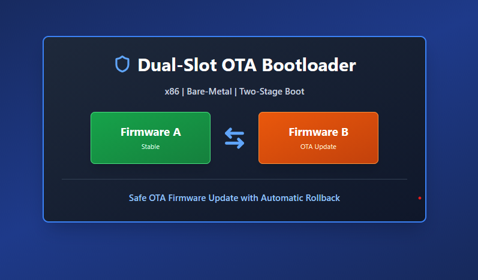
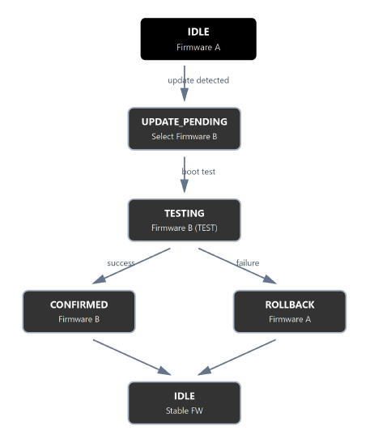
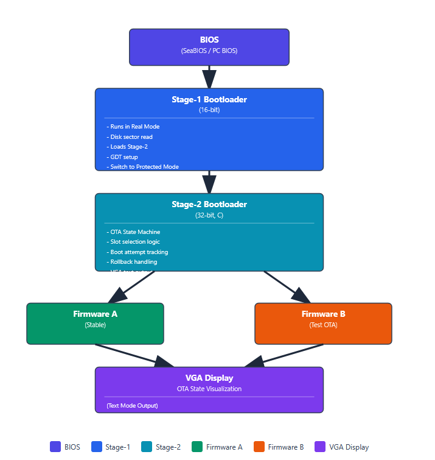
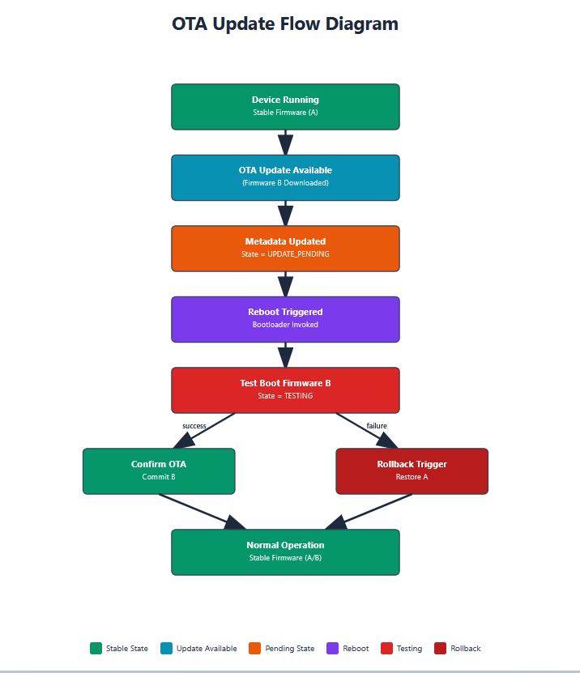
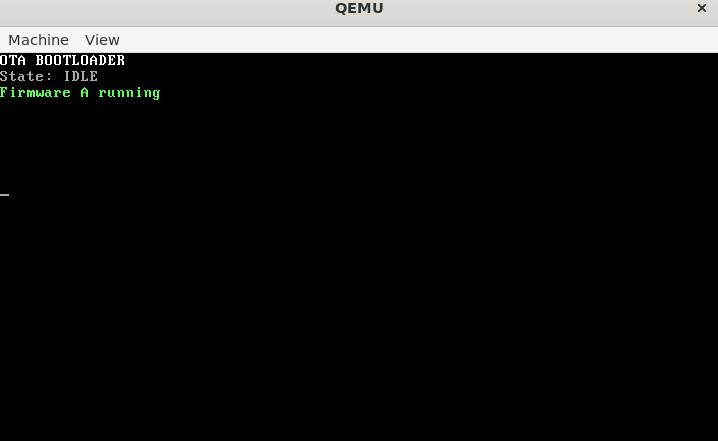
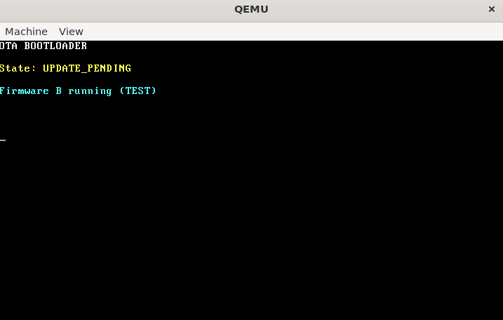
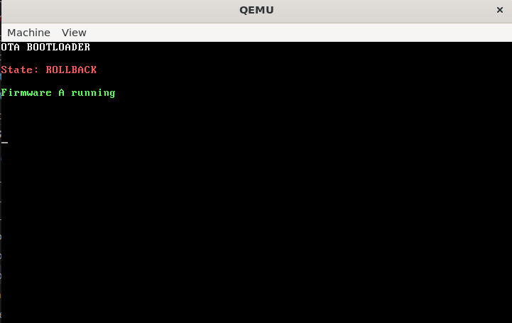

<p align="center">
  
</p>

<h1 align="center">🔐 Dual-Slot OTA Bootloader (x86 | Bare-Metal)</h1>

<p align="center">
  <b>Safe OTA Firmware Update with Automatic Rollback</b>
</p>

<p align="center">
  
  
  
  
  
</p>

---

##  Project Overview

This project implements a **dual-slot Over-The-Air (OTA) bootloader on x86 architecture**, demonstrating a **safe firmware update lifecycle with automatic rollback**.

The system uses a **two-stage bootloader**:

- **Stage-1 (16-bit real mode)**  
  Loads stage-2 and switches the CPU to protected mode.

- **Stage-2 (32-bit protected mode, freestanding C)**  
  Implements an OTA state machine and firmware selection logic.

The project focuses on **boot safety, update validation, and rollback reliability**, which are critical requirements in **embedded, automotive, and industrial systems**.

---

##  Key Objectives

- Demonstrate safe OTA update flow  
- Prevent bricking via automatic rollback  
- Show dual firmware slot mechanism  
- Implement bootloader logic without any OS or libc  
- Provide visual proof of each OTA state using VGA text output  

---

##  OTA State Machine

The bootloader operates using the following OTA states:

| State               | Description                                              |
|---------------------|----------------------------------------------------------|
| **IDLE**            | Normal boot using stable firmware (Firmware A)           |
| **UPDATE_PENDING**  | New firmware detected, test boot initiated               |
| **TESTING**         | Firmware B running under observation                     |
| **ROLLBACK**        | Test firmware rejected, fallback to Firmware A           |

<p align="center">
  
</p>

---

## System Architecture

The complete boot flow is illustrated below:

<p align="center">
  
</p>

**Boot Flow:**

BIOS
↓
Stage-1 Bootloader (16-bit)

Disk read

GDT setup

Protected mode switch
↓
Stage-2 Bootloader (32-bit)

OTA state machine

Firmware selection

VGA output
↓
Firmware A / Firmware B


---

##  OTA Lifecycle Flow

<p align="center">
  
</p>

⚠️ **Note**  
For demonstration purposes, OTA states are **simulated in software** (no flash writes).

---

## 🖥️ Visual OTA Lifecycle (Simulated Output)

###  Screenshot 1 — IDLE (Normal Boot)

**Description:**  
System boots normally using the stable firmware (Firmware A).

**Output**
OTA BOOTLOADER
State: IDLE
Firmware A running


<p align="center">
  
</p>

---

###  Screenshot 2 — UPDATE_PENDING (Test Boot)

**Description:**  
An update is detected and Firmware B is booted in test mode.


**Output**
OTA BOOTLOADER
State: UPDATE_PENDING
Firmware B running (TEST)


<p align="center">
  
</p>

---

###  Screenshot 3 — TESTING (Retry)

**Description:**  
Firmware B is re-attempted after a failed validation cycle.


**Output**
OTA BOOTLOADER
State: TESTING
Firmware B running (TEST)


<p align="center">
  
</p>

---

###  Screenshot 4 — ROLLBACK (Recovery)

**Description:**  
Firmware B is rejected and the system safely rolls back to Firmware A.


**Output**
OTA BOOTLOADER
State: ROLLBACK
Firmware A running


<p align="center">
  
</p>

---

##  Build & Run Instructions  
*(Ubuntu / Windows WSL)*

### Stage-1 Bootloader
```bash
nasm -f bin start16.asm -o stage1.bin


Stage-2 Bootloader
gcc -m32 -ffreestanding -nostdlib -fno-pic -fno-stack-protector \
    -c bootloader.c -o bootloader.o

ld -m elf_i386 -T linker.ld start32.o bootloader.o -o stage2.elf
objcopy -O binary stage2.elf stage2.bin


Write to Disk Image : 

dd if=stage1.bin of=disk.img bs=512 count=1 conv=notrunc
dd if=stage2.bin of=disk.img bs=512 seek=1 conv=notrunc
sync


▶ Run in QEMU
qemu-system-i386 -drive file=disk.img,if=floppy,format=raw -boot a


👤 Author

Siddarth S
Domain: Embedded Systems | Bootloaders | OTA Updates | Linux | RTOS